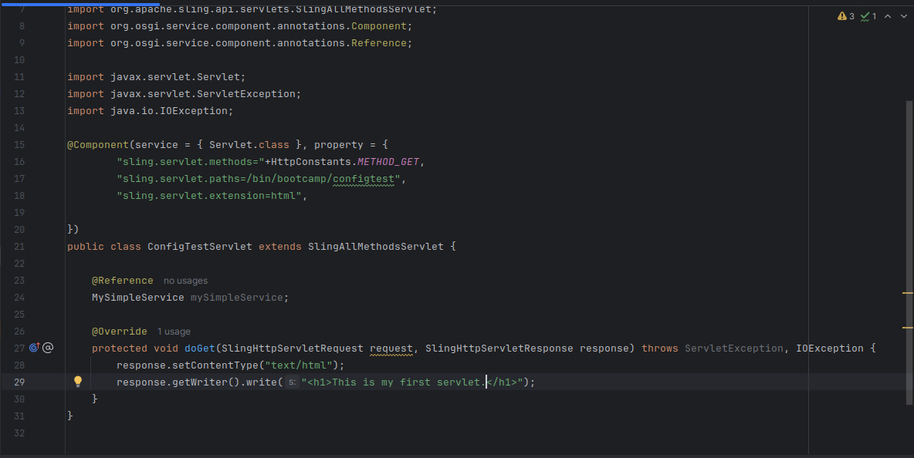

1. Create a servlet and register it on path /bin/training/configtest and extension as html, method as GET. It should print the hardcoded message "This is my first servlet."

->  
package com.ttn.bootcamp.core.servlets;

import org.apache.sling.api.SlingHttpServletRequest;
import org.apache.sling.api.SlingHttpServletResponse;
import org.apache.sling.api.servlets.HttpConstants;
import org.apache.sling.api.servlets.SlingAllMethodsServlet;
import org.osgi.service.component.annotations.Component;

import javax.servlet.Servlet;
import javax.servlet.ServletException;
import java.io.IOException;

@Component(service = { Servlet.class }, property = {
        "sling.servlet.methods="+HttpConstants.METHOD_GET,
        "sling.servlet.paths=/bin/bootcamp/configtest",
        "sling.servlet.extension=html",

})
public class ConfigTestServlet extends SlingAllMethodsServlet {

    @Override
    protected void doGet(SlingHttpServletRequest request, SlingHttpServletResponse response) throws ServletException, IOException {
        response.setContentType("text/html");
        response.getWriter().write("<h1>This is my first servlet.</h1>");
    }
}

